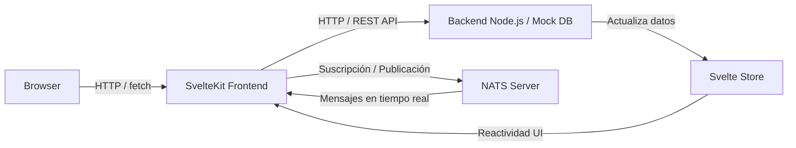

## Iot Senors App 

Aplicación demo para la gestión y visualización de sensores IoT. 

## Índice

<a href='#requisitos'>Requisitos</a>
<br/>
<a href='#iniciar-nats-server'>Iniciar nats server</a>
<br/>
<a href='#ejecución-rápida-macos-y-linux'>Ejecución rápida macOs y linux</a>
<br/>
<a href='#window-start'>Ejecución rápida Window</a>
<br/>
<a href='#credenciales-de-prueba'>Credenciales de prueba Login</a>
<br/>
<a href='#tests'>Tests</a>
<br/>
<a href='#npm-packages'>Paquetes NPM utilizados</a>
<br/>
<a href='#estructura-del-proyecto'>Estructura del proyecto</a>
<br/>
<a href='#data-flow-clean--flux'>Data Flow (clean-flux)</a>
<br/>
<a href='#diagrama-explicativo-de-la-solución-propuesta'>Diagrama explicativo de la solución propuesta</a>
<br/>


## Inicio rápido

###  Requisitos

Antes de ejecutar la aplicación, asegúrate de tener instaladas las siguientes herramientas:


| **Node.js**  ≥ `v24.8.0`  `node -v` 
| **npm**  ≥ `11.6.0`  `npm -v` 
| **nodemon**  ≥ `3.1.10`  `nodemon -v` 
| **Git**  última  `git --version` 
| **Nats Server** `nats-server`

> 💡 Si alguno de estos programas no está instalado, sigue la guía de instalación más abajo.

```bash
# ------------------------
# MacOS
# ------------------------

# Instalar Node.js y nodemon
brew install node
npm install -g nodemon

# Instalar NATS Server
brew install nats-server

# ------------------------
# Linux (Ubuntu / Debian)
# ------------------------

# Node.js y nodemon
sudo apt update
sudo apt install -y nodejs npm
sudo npm install -g nodemon

# NATS Server
sudo apt install -y nats-server

# ------------------------
# Windows
# ------------------------

# 1️⃣ Descarga e instala Node.js desde:
# 👉 https://nodejs.org/es/download/
# 2️⃣ Abre PowerShell como administrador y ejecuta:
npm install -g nodemon

# 3️⃣ Descarga NATS Server para Windows desde:
# 👉 https://github.com/nats-io/nats-server/releases
# Extrae el ejecutable y añádelo a tu PATH para poder ejecutar:
# nats-server -v

```
### Ejecución rápida MacOs y Linux 

Una vez instalado Node, NPM, Nodemon y Nats, puedes iniciar la aplicación con:

Copia y pega este script en tu terminal.

```bash
git clone https://github.com/manuel-crispino/iot-sensors-app.git
cd iot-sensors-app
npm run quick
```

### Window start

Una vez instalado Node, NPM, Nodemon y Nats, puedes iniciar la aplicación.
Copia y pega este script en tu terminal PowerShell o CMD (en Windows):

```bash
git clone https://github.com/manuel-crispino/iot-sensors-app.git
cd iot-sensors-app
npm install
npm run dev
```
Abre un nuevo terminal de Windows y ejecuta:

```bash
cd iot-sensors-app
cd server 
npm install
npm run dev
```


## Iniciar NATS Server

Una vez instalado, puedes iniciar NATS con:

```bash
# MacOS / Linux
nats-server -c nats-server.conf

# Windows (desde PowerShell)
nats-server.exe -c nats-server.conf
```

## Credenciales de prueba

Puedes iniciar sesión con las siguientes credenciales:

username: admin
password: password


## Tests 

### Run tests
    Requisitos adicionales (solo para ejecutar los tests del navegador)
    Asegúrate de tener instaladas las siguientes dependencias:

    ```bash
    npm install --save-dev playwright
    
    # Consejo: instala solo Chromium para que los tests sean más rápidos: 

    npx playwright install chromium 

    # ------------- Ejecutar los tests -------------------

    cd iot-sensors-app
    npm run test

    ```

### Test Pattern AAA 
  Los tests siguen el patrón AAA (Arrange, Act, Assert):

  Arrange:
    - Preparamos todo lo necesario para el test

  Act:
    - Ejecutamos la acción que queremos probar

  Assert:
    - Verificamos que el resultado sea el esperado

## npm packages 

- nats.ws   // socket 
- uuid      // Universally Unique Identifier
- lucide-svelte // icons 
- @zerodevx/svelte-toast // notifications


## Estructura del proyecto
```bash
src/
├── application/                # Lógica de la aplicación (servicios, casos de uso)
│   ├── natsService.ts          # Funciones para conectar en NATS
│   ├── sensorService.ts        # Funciones CRUD y lógica de sensores
│
├── domain/                     # Modelos y tipos del dominio
│   └── form.ts                 # Definición del tipo form
│   └── sensor.ts               # Definición del tipo Sensor
│   └── user.ts                 # Definición del tipo User
│
├── infrastructure/             # Acceso a backend, almacenamiento, NATS
│   ├── mockDatabase.ts         # Backend simulado (simula DB)
│
├── lib/
│   └── components/             # Componentes reutilizables
│       ├── auth/               # Componentes específicos de autenticación
│       │   ├── LoginForm.svelte
│       │
│       ├── common/             # Componentes genéricos reutilizables
│       │   ├── Button.svelte
│       │   ├── Card.svelte
│       │   ├── Form.svelte
│       │   ├── Input.svelte
│       │   └── Modal.svelte
│       │
│       ├── dashboard/          # Componentes específicos del dashboard
│       │   └── FilterSelect.svelte
│       │   ├── SensorForm.svelte
│       │   ├── TablaSensor.svelte
│       │
│       │
│       └── feedback/           # Componentes para UI dinámica o retroalimentación
│       │   ├── Loading.svelte
│       │   ├── Notifications.svelte
│       │   ├── Overlay.svelte
│       │   ├── SvelteToast.svelte
│       │
│       ├── layout/             # Componentes relacionados con el layout global
│       │   ├── Container.svelte
│       │   ├── Footer.svelte
│       │   ├── Nav.svelte
│       │
│       ├── utils/             # Funciones útiles (helpers y utilidades generales)
│       │   ├──handleToast.ts   # Muestra notificaciones tipo "toast" con información del sensor 
│       │
├── routes/                     # Páginas y layout de SvelteKit
│   ├── +layout.svelte          # Layout global (header, footer, slot)
│   ├── login/
│   │   ├── +page.svelte        # Página de login
│   │   
│   └── dashboard/
│       ├── +page.svelte        # Página del dashboard
│       └── +page.ts            # Función load, autenticación, fetch de sensores
│
└── stores/                     # Stores de Svelte (patrón Flux)
│  ├── sensorsStore.ts         # Estado de los sensores y funciones reactivas
│  └── authStore.ts            # Estado de autenticación del usuario
│  └── themeStore.ts           # Estado de tema 
│
└── test/                     # test 
│       ├── browser/           # Tests end-to-end con Playwright
│       │   ├── login.spec.ts
│       │   ├── dashboard.spec.ts
│       │
│       └── server/            # Tests de API o NATS
│           ├── sensors.test.ts
│
```

## Data Flow (Clean + Flux)

La aplicación sigue un flujo **unidireccional de datos**, inspirado en la arquitectura **Clean Architecture** combinada con el patrón **Flux**.  
Esto garantiza una separación clara entre capas y facilita la escalabilidad.

🧩 Componentes Svelte (acciones / eventos)
<br/>
↓
<br/>
⚙️ Stores (sensorsStore / authStore)
<br/>
↓
<br/>
🧠 Capa de aplicación (sensorService)
<br/>
↓
<br/>
🗄️ Capa de infraestructura o Server (mockBackend / NATS / server.js)
<br/>
↓
<br/>
🔁 Retorno al Store → Actualización reactiva de la UI
<br/>

## Diagrama explicativo de la solución propuesta

